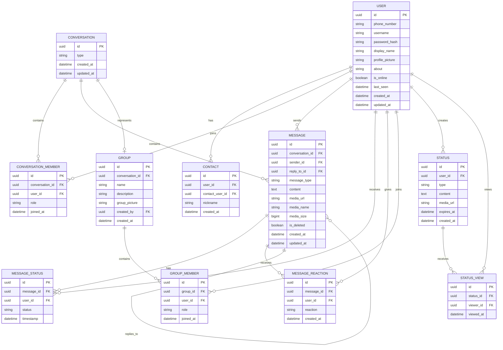

# Entity Relationship Diagram

## Description

The application consists of ten main entities:

1. User
2. Contact
3. Conversation
4. Conversation Member
5. Message
6. Message Status
7. Message Reaction
8. Group
9. Group Member
10. Status
11. Status View

Relationships:

* A User can have multiple Contacts.
* A User can participate in multiple Conversations.
* A Conversation can have multiple Members.
* A Conversation can contain multiple Messages.
* A User can send multiple Messages.
* A Message can reply to another Message.
* A Message can have multiple Reactions.
* A Message can have multiple Message Status records.
* A Conversation can represent a Group.
* A Group can have multiple Members.
* A User can belong to multiple Groups.
* A User can create multiple Statuses.
* A Status can have multiple Views.
* A User can view multiple Statuses.

## Mermaid ER Diagram

## Future Enhancements

* End-to-End Encryption
* Message Search
* Pinned Messages
* Starred Messages
* Chat Archiving
* Chat Mute
* User Blocking
* Advanced Privacy Settings
* Push Notifications
* Call History
* Group Audio/Video Calls
* Multi-Device Support
* Redis-Based Presence
* Celery Background Tasks
* Message Queue Integration
* CI/CD Pipeline
